============
Ion Trapping
============

.. toctree::
   :maxdepth: 2

Theoretical overview
====================

Consider a linear Paul trap configuration as depicted in the figure
below. With voltages :math:`\pm [U + V \cos(\Omega)]/2` applied to
opposite pairs of electrodes, the Mathieu stability parameters are
then

.. math::
   :label: MathieuStability

   q &= \frac{2ZeV}{mr_0^2 \Omega^2} \\
   a &= \frac{4ZeU}{mr_0^2 \Omega^2}

where :math:`\Omega` is the RF (angular) frequency, :math:`r_0` is the
trap radius, and :math:`Ze` (:math:`m`) is the ion charge (mass).

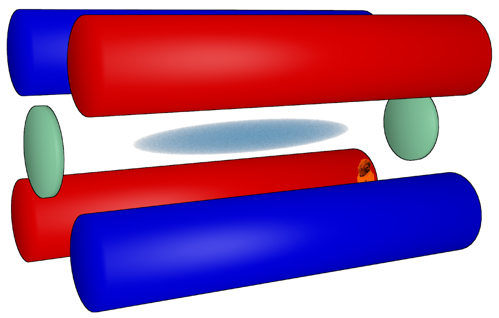

   Generic linear Paul trap configuration. Red and blue electrodes
   have opposite RF phase for radial confinement while green
   electrodes represent DC end caps for axial confinement.

The first region of stability is depicted below. Ions falling in the
shaded region have stable orbits and are thus trapped.

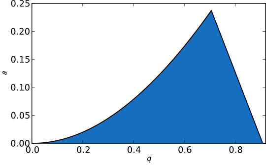

For laser cooling |Ba+| ions, lasers at 493 nm and 650 nm are used as
shown in the level scheme below:

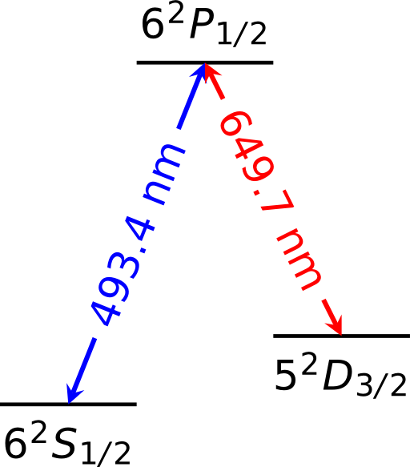

   Simplified level structure for |Ba+|.

Ablation loading
================

Loading an ion trap via ablation of a target is in principle very
straightforward, but in practice can be somewhat challenging. It is
generally best to orient the ablation target outside the ion trap and
near an end cap in order to load axially as shown below.

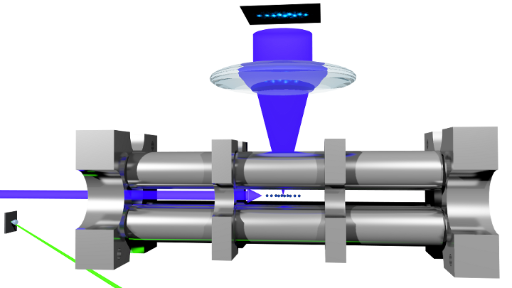
   
   Placement of an ablation target (gray square, far left) outside a
   linear Paul trap.

This orientation allows for dynamic loading, which is simply the
gating of the front end cap [#]_ (FEC). To do this, prior to firing
the ablation pulse, the FEC voltage should be set to ground and the
back end cap (BEC) voltage should remain high. Then, some microseconds
after firing the ablation laser, the FEC is quickly raised to its high
voltage. The exact timing must be optimized for the geometry and the
ions involved. End cap gating is accomplished using a simple MOSFET
switch circuit similar to that shown below.

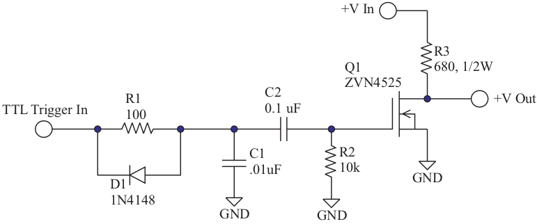

   End cap gating circuit. This figure is taken from C.J. Campbell's
   PhD thesis.

There are three separate things that must be timed for ablation
loading:

1. YAG flashlamp
2. YAG Q-switch
3. End cap gating

The first two can in principle be combined since the YAG control unit
can be configured for internal timing of the flashlamp relative to the
Q-switch, but in practice it is easiest to adjust the timing with a
pulse generator in order to maximize output power. The YAG manual
should be consulted for approximate starting values. To optimize the
timing of the flashlamp and Q-switch, a power meter can be used to
maximize the power while adjusting one pulse time relative to the
other.

Laser Locking
=============

For laser cooling and fluorescence of |Ba+|, locking of lasers is not
usually needed since the main cooling transition has a linewidth of
nearly 15 MHz and grating stabilized lasers that are in a good,
thermally stable mount will usually not drift more than a few MHz over
a timescale of several minutes. Nevertheless, it is often convenient
to lock the lasers to avoid the complication of frequently tweaking
the detunings.

Since creating a vapor of |Ba+| ions is not really practical, some
other method of producing reference lines for locking must be
employed. One approach is to use a transfer cavity which is referenced
to a vapor cell-locked laser. This cavity can then be used to lock one
or more other lasers. The scheme used here is to have a separate
reference cavity for each of the lasers of the |Ba+| lambda
system. Either the 780 nm or the |Ba+| laser is given sidebands in
order to be able to (a) make up for the fact that the two transmitted
signals will never be perfectly overlapped and (b) to be able to
detune the lasers as needed.

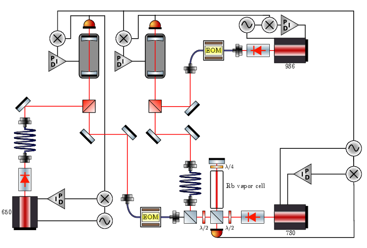

   Overview of the transfer cavity setup.

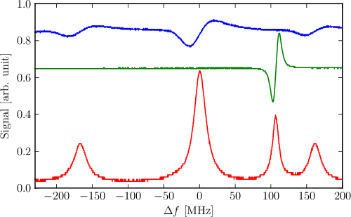

   Captured signal from a transfer cavity with 780 nm and 986 nm
   transmitted signals. (Red) Transmitted DC signal. (Blue) 986 error
   signal. (Green) 780 error signal. In this locking scheme, sidebands
   are added to the 986 nm carrier in order to overlap with the 780 nm
   transmission signal. The 493 nm laser is then detuned by varying
   this sideband frequency while the laser remains locked to the
   cavity.

LabView Programs
================

Loading and control of voltages of the ion trap is controlled via a
LabView interface titled ``LoadProcedure2.vi`` and laser frequencies
are monitored using ``ShutterControl.vi``.

Trap control VI
---------------

The RF voltage is controlled with an RF set voltage, which corresponds
to voltage of a power supply that can be remotely set with an analog
voltage from the NI card. The FEC and BEC voltages in the control
program correspond to the actual voltages the end caps are set to
[#]_. These values are calibrated in a sub VI such that the value
displayed in the control program corresponds to an analog output
voltage between 0 and 10 V from the NI card.

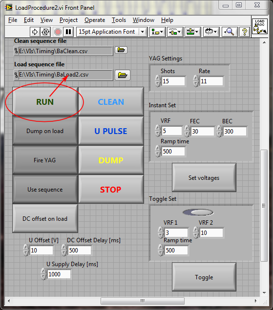

   The ``RUN`` button initiates the load sequence file and fires the
   YAG with the settings given. If ``Dump on load`` is selected, the
   trap contents will first be dumped by briefly turning off the RF
   voltage with a TTL pulse to the RF supply. If ``Fire YAG`` is not
   selected, the load sequence file will be run, but the YAG will not
   be fired. If ``Use sequence`` is not depressed, all actions other
   than running the load sequence file will be performed (e.g., if
   ``Dump on load`` and ``Fire YAG`` are depressed, but ``Use
   sequence`` is not, then the trap will be emptied and the YAG will
   be fired at whatever the present RF set voltage is). ``DC offset on
   load`` will enable DC offset voltages to the RF to be applied
   during loading [#]_.

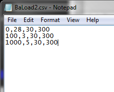
   
   Load sequence file example. Each column in the CSV file is,
   respectively, the time in ms, the RF set voltage, the FEC voltage,
   and the BEC voltage.

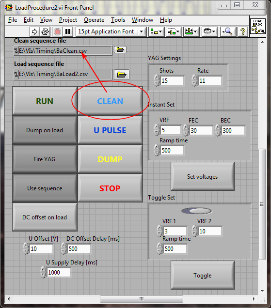

   The ``CLEAN`` button initiates the clean sequence file. Typically
   this is used for briefly ramping voltages very high and very low
   such that most lighter and heavier ions than those of interest are
   ejected. The load and clean sequence files use the same format.

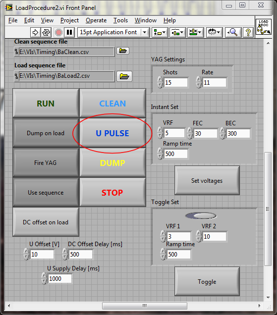

   The ``U PULSE`` button will briefly apply DC offsets to the RF
   voltages for the purposes of ejecting particular masses. The
   voltage applied and for how long is controlled with the settings on
   the bottom left.

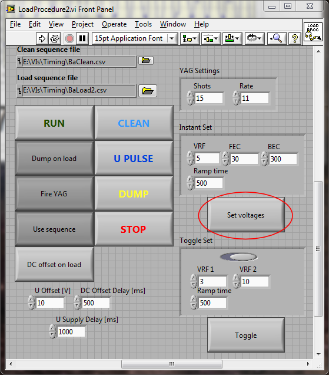

   The ``Set voltages`` button will ramp the RF and end cap voltages
   to the values set in the box above.

Shutter control VI
------------------

Laser frequencies are monitored with the High Finesse WS-7 wavelength
meter ("wavemeter") and a LabView VI to control shutters to only allow
in one wavelength at a time. The wavemeter program is useful for
displaying the interferometer signals as well as adjusting the
detector exposure times. The interferometer signals can be useful for
indicating whether or not a laser is running multimode or single mode,
as shown in the comparison below.

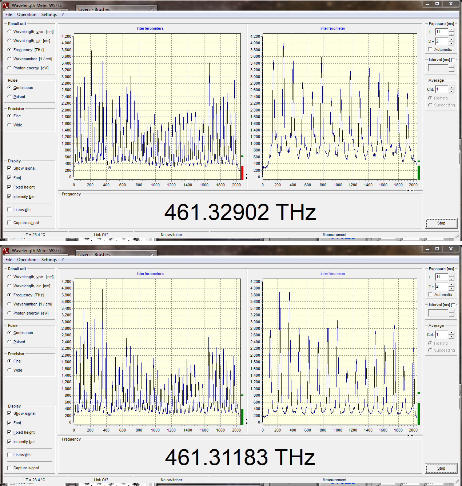

   Signal from the 650 nm laser. (Top) The laser is slightly multimode
   and needs to have the PZT or current tweaked to become single mode
   (bottom).

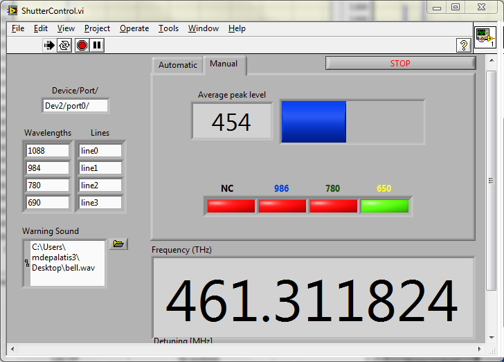

   The shutter control VI. Pressing the LED under the wavelength will
   send TTLs to a shutter control box which will open that shutter and
   close the others.

Footnotes
=========

.. [#] The "front" being defined by the proximity to the target.
.. [#] Although both end caps can be set independently, oftentimes the
       BEC voltage supply is used for both end caps, and so the FEC
       voltage is arbitrary as it does not correspond to anything
       actually being controlled.
.. [#] This feature has not been used much, and in fact is not
       compatible with using DC bias offsets to compensate for excess
       micromotion.

.. |Ba+| replace:: Ba\ :sup:`+`\
