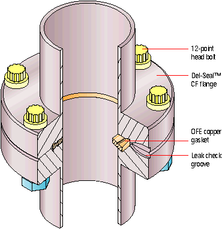
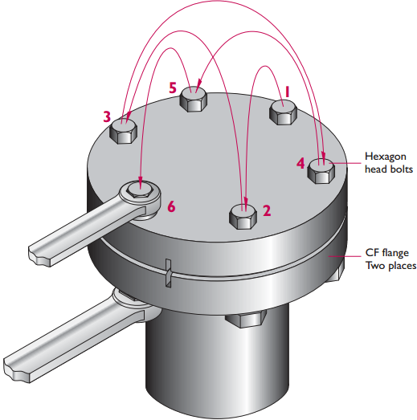

===============
Vacuum Handbook
===============

.. toctree::
   :maxdepth: 2

Preparing Components for UHV
============================

At low pressures, many materials will outgas__ which prevents UHV
pressures from being reached. In general, this limits the materials
available for use in components that go in vacuum. A short list of
UHV-compatible materials includes:

__ https://en.wikipedia.org/wiki/Outgassing#Outgassing_in_a_vacuum

* Glasses: Quartz, Pyrex, etc.
* Metals: Stainless steel (types 303, 304, and 316 are the most
  commonly used in vacuum), certain alloys of aluminum, beryllium
  copper, gold, silver
* Electrical insulators: Polyimide (Kapton), PTFE (Teflon), PEEK

For a more complete list, see `this document`__ maintained by
LIGO. Since skin oils can outgas, it is important to always handle
components that will go under vacuum with clean nitrile or latex
gloves.

__ http://www.ligo.caltech.edu/docs/E/E960050-B/E960050-B.pdf

Apart from vacuum components obtained and cleaned by the manufacturer
[#]_, everything that goes into a UHV chamber should first be
thoroughly cleaned. For simply shaped components which do not contain
a lot of holes or other difficult to reach surfaces, it is usually
sufficient to thoroughly wipe down the component with isopropanol,
methanol, or acetone using tissues such as Kim Wipes while wearing
gloves [#]_. When there are many parts to clean, or the parts are too
difficult to clean by hand, the ultrasonic cleaner should be used
instead. Here, components are placed in the smallest possible beaker
and bathed with solvent. This beaker is placed in the ultrasonic
cleaner basin with a piece of teflon separating it from the metal base
to prevent damaging the glass, and water is added to the basin up to
the liquid level in the beaker. The ultrasonic cleaner can then be
turned on, with 30 minutes being a good amount of time to run it. When
the cleaning cycle is complete, the components should be removed and
placed on a cleaned sheet of aluminum foil (preferably UHV grade foil)
and allowed to dry in the fume hood for a few minutes before being
transported to the vacuum chamber.

For components that have recently been machined, it is also a good
idea to run them through an ultrasonic cleaner cycle first with water
and dish soap. This helps to remove any remaining cutting oil used in
the machining process. Following this cycle, the part should be
thoroughly rinsed to remove soap, and then run through the cleaner
again but with solvent as in the preceding paragraph.

For machined components that go into UHV systems, it is best to
minimize the number of holes and complicated surfaces. When designing
parts which require bolts to be used, the bolts should either be
vented or the tapped holes should be through holes. This is because an
un-vented bolt in a blind hole can trap gas that will slowly work its
way out through the threads when the rest of the chamber is at a lower
pressure (this is known as a “virtual leak”). It is also a good idea
to use silver or gold plated bolts if the components being fastened
are also made of stainless steel.

CF Flanges and Hardware
=======================

For UHV applications, one will generally use vacuum components with CF
flanges [#]_. Each CF flange contains a knife edge which digs into a
gasket (either OFHC copper for normal circumstances, an elastomer such
as Viton when no or low temperature bakeouts are required, or nickel
for corrosive environments) to make a vacuum-tight seal. When sealed
and properly baked out, these flanges are capable of sustaining vacuum
levels of below 10\ :sup:`-13` torr.

As an industry standard, there are several standardized sizes of CF
flanges. They are labeled by the outer diameter of the flange
itself. Common sizes include 1.33” (or “mini”), 2.75” (the most common
size encountered), 4.5”, 6”, and 8”. Larger sizes also exist, but are
not frequently used with UHV equipment in atomic physics experiments.

   **Figure**: Cross section of two mated CF flanges. Image courtesy
   of MDC.

Two types of flanges exist: those with through holes, and those with
tapped holes. Bolts must be made of stainless steel for both strength
and resistance to corrosion during bakeouts. Since UHV components are
usually baked out at high temperatures, which can lead to like metals
seizing, it is vitally important that either a small amount of
anti-seize lubricant is applied to the bolt threads when making seals,
or that silver plated bolts are used. Since anti-seize is certainly
not vacuum-compatible, one must be especially careful to not get any
into the vacuum side. For this reason, silver plated bolts are
preferable since they require no lubrication, but their major downside
is the cost. Bolts have either hex heads or 12-point heads. The latter
are more resistant to slipping in the wrench, but can be damaged more
easily if overtightened [#]_.

To make a proper seal, the bolts should be tightened in an alternating
fashion in order to apply fairly even pressure all around the
gasket. This is sometimes referred to as a “star pattern” since when
properly alternating bolts on a 2¾” flange, the pattern traced out by
jumping between bolts looks like a 6-point star. When beginning the
fastening process, all bolts can first be tightened by hand. Then,
while following the alternating star pattern, each bolt should be
tightened by 1/8 to 1/4 of a turn. Each bolt is then further tightened
over several passes until the torque specification is
met. Alternatively, a good rule of thumb is to keep going until the
flanges are "metal-to-metal," i.e., no gap is visible between the two
flanges. Whatever you do, don’t overtighten! For larger flanges, it is
often helpful to use a permanent marker to label each bolt with a
number so that it’s easy to keep track of what bolt to tighten next.

   **Figure**: Star pattern for properly sealing a 2.75" CF
   flange. Image courtesy MDC.

Electrical Connections
======================

Connections between electrodes and feedthroughs can be made in a
number of ways including spot welding and the use of push-on
connectors or inline barrel connectors. Soldering is also an option,
but this requires the use of special UHV-compatible silver solder
which requires special techniques that differ greatly from those used
with lead-based solder.

Spot welding works best when the materials being welded together are
identical, or at least have comparable melting points (see the table
below). For example, for stainless steel electrodes, stainless steel
wire should be used. When spot welding wire to a part, the heat should
be adjusted such that minimal arcing occurs but that the wire and part
are successfully welded together. It is sometimes helpful to clean the
spot welder tips with isopropyl or other solvent in order to make a
good weld. Wires and parts should be spot welded together at several
points in order to strengthen the connection. It is generally not
advisable to spot weld directly to a feedthrough since (a) the
materials are often not compatible in terms of melting points and (b)
that risks damaging the feedthrough by causing a leak. Instead, it is
better to use push-on or barrel connectors to connect wires to
feedthrough pins.

.. TODO

**Table**: Melting points of metals commonly used in UHV components.

================   ===================================
   **Metal**         **Melting points [degrees C]**
================   ===================================
Aluminum             660
Beryllium copper     865-955
Nickel               1453
Monel                1300-1350
Molybdenum           2620
Stainless steel      1510
================   ===================================

Leak Checking
=============

Even when properly alternating bolts when tightening, it is possible
to be left with a very tiny leak somewhere. Since helium can easily
diffuse through small openings, it is an ideal test gas to use for
leak checking. In order to do this, the assembled chamber must be
connected to the pumping station with the RGA. For oil-based roughing
pumps, the procedure to get to a high enough vacuum (< 10\ :sup:`-4`
torr) to operate the RGA is as follows [#]_:

1. Make sure valves are open (to your system and to bellows)
2. Close turbo Swagelok valve, remove gas purge line
3. Open roughing valve
4. Start roughing pump
5. Press start on the turbo pump

   1. Wait until 4 lights are on

1. Turn on ion gauge
2. When pressure reaches 10\ :sup:`-5`\--10\ :sup:`-6` torr, turn on
   the RGA filament (with software set to Leak Test mode)

This procedure is identical for oil-free roughing pumps, though there
is no need for a valve between the roughing pump and the turbo
pump. To check for leaks, connect a regulator to a helium tank and use
a fairly small flow of helium through some plastic tubing. A small
flow of helium is better than a large flow since with a strong flow,
helium could be reaching multiple areas simultaneously, thus rendering
determination of the leak point more difficult. Slowly and
methodically aim helium along all flange connections and feedthrough
pins. If the RGA registers a leak on a flange, very carefully further
tighten the connections using the same star pattern as before
[#]_. Leak check the flange again. If there is still a leak, try
tightening some more. If it can still not be fixed, it is possible
that the initial tightening was not done evenly, and so it will be
necessary to vent the chamber, disconnect the affected area, and
remake the connection.

Bakeout
=======

When exposed to atmosphere, stainless steel and other materials will
quickly adsorb water. Because it has a high vapor pressure at room
temperature, water will prevent a freshly-pumped system from attaining
UHV pressures if it is not driven out of the system. This is most
easily achieved by elevating the temperature of the vacuum components
while actively pumping on the system. This procedure is termed a
bakeout. The higher the temperature, the more quickly water will be
removed from the system, and so it is ideal to use the highest
temperature allowed by the parts used in the chamber (the limiting
temperature is therefore set by the component whose maximum
temperature is the lowest).

When baking out a chamber, it is vital to heat the entire chamber as
evenly as possible to avoid causing leaks from stresses caused by
temperature gradients. The temperature should also be both increased
and decreased gradually.

Useful Formulae
===============

Conductance is related to the volumetric flow :math:`Q` between two
regions of pressures :math:`P_1` and :math:`P_2` by

.. math:: C = \frac{Q}{P_2 - P_1}

Parallel conductances:

.. math:: C_T = C_1 + C_2 + C_3 + \cdots

Series conductances:

.. math:: \frac{1}{C_T} = \frac{1}{C_1} + \frac{1}{C_2} +
	  \frac{1}{C_3} + \cdots 

Relationship between pumping speed, volumetric flow, and pressure:

.. math:: S = \frac{Q}{P}

Conductance of a tube of length L (in inches) and inner diameter D (in
inches) in L/s:

.. math:: C = 75 \frac{D^3}{L}

Effective pumping speed (in L/s) through a tube with conductance C (in
L/s):

.. math:: \frac{1}{S_{\text{eff}}} = \frac{1}{S_{\text{spec}}} +
	  \frac{1}{C}

List of Vendors
===============

* `Accu-Glass Products`__: Feedthroughs and electrical accessories
  (both vacuum side and air side), vented bolts, viewports, gaskets,
  etc.
* `Duniway Stockroom`__: New and refurbished general vacuum
  components, gauges, pumps; repair of some components

   * They are almost always the least expensive option for what they
     sell, and their customer service is good and quite knowledgeable.
   * See also their documents page for manuals and some technical
     notes on things like conductance.

* `Kurt J. Lesker`__: Basically all stock components. Usually cheaper
  than MDC.
* MDC__: Basically all stock components. Usually more expensive than
  Lesker.
* Huntington__: Basically all stock components.
* `Kimball Physics`__: Really awesome chambers and Erector Set-like
  parts for in-vacuum construction

__ http://accuglassproducts.com
__ http://www.duniway.com/
__ http://www.lesker.com
__ http://mdcvacuum.com/
__ http://www.huntvac.com/
__ http://www.kimballphysics.com/

References and Further Reading
==============================

* `K.J. Lesker: CF Flange Technical Notes`__
* `MDC Del Seal CF Flanges: Introduction`__
* `Metals - Melting Temperatures`__
* J.F. O’Hanlon, A User’s Guide to Vacuum Technology,
  (Wiley-Interscience, New York, 1989), 2nd ed.

__ http://lesker.com/newweb/flanges/flanges_technicalnotes_conflat_1.cfm?pgid=0
__ http://www.mdcvacuum.com/DisplayContentPage.aspx?d=MDC&cc=f8c467bf-0008-4d34-9342-caaa07ee8d95
__ http://www.engineeringtoolbox.com/melting-temperature-metals-d_860.html

Footnotes
=========

.. [#] It doesn’t hurt to also clean new components, anyway. MVD once
       found a big fingerprint on a brand new viewport upon opening
       the packaging!
.. [#] Viewports and other optical components should be treated with
       the same care as all optics: Use lens tissue and either
       methanol or acetone in this case.
.. [#] CF originally standing for ConFlat, which was developed by
       Varian.
.. [#] Don’t overtighten!
.. [#] These steps are taken from the instructions on the mobile
       pumping station.
.. [#] Since the turbo pump is running and the RGA is on, think twice
       before trying to tighten! Bad things can happen if you loosen
       instead of tighten flange bolts while under vacuum with things
       running that aren’t meant to operate in atmosphere!
